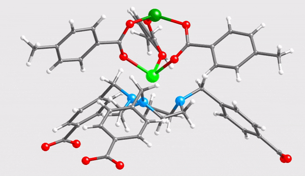

Supporting information for: [“Molecular Simulation of a Zn–Triazamacrocyle Metal–Organic Frameworks Family with Extraframework Anions”](https://doi.org/10.1021/jp209895d), M. De Toni, F.-X. Coudert, S. Paranthaman, P. Pullumbi, A. Boutin and A. H. Fuchs, _J. Phys. Chem. C_, **2012**, 116 (4), 2952–2959, DOI: [10.1021/jp209895d](https://doi.org/10.1021/jp209895d)

**Associated data:**

- [`Zn-CBTACN.cif`](Zn-CBTACN.cif): crystal structure for the Zn-CBTACN MOF, in CIF format; CBTACN = 1,4,7-tris(4-carboxybenzyl)-1,4,7- triazacyclononane
- [`Zn-CBTACN-cluster.xyz`](Zn-CBTACN-cluster.xyz): structure of the representative cluster extracted from the crystalline Zn-CBTACN MOF
- [`Zn-CBTACN-cluster.mov`](Zn-CBTACN-cluster.mov): rotating view of the cluster

 
