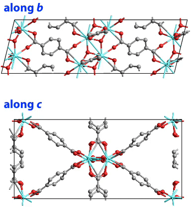

Supporting information for: [“Metal-organic frameworks with wine-rack motif: What determines their flexibility and elastic properties?”](https://doi.org/10.1063/1.4802770), A. U. Ortiz, A. Boutin, A. H. Fuchs and F.-X. Coudertt, _J. Chem. Phys._, **2013**, 138, 174703, DOI: [10.1063/1.4802770](https://doi.org/10.1063/1.4802770)

**Results / analysis code:**

- [`analysis_code.nb`](analysis_code.nb): source code used for tensorial analysis of the second-order elastic constants, as a Mathematica notebook
- [`analysis_code.pdf`](analysis_code.pdf): PDF version of the source code
- [`MIL-140A-Young.mp4`](MIL-140A-Young.mp4): Movie of the uniaxial strain along the lattice vector [0.05, −0.56, 0.83] on the MIL-140A structure (see Figure 7).

 
