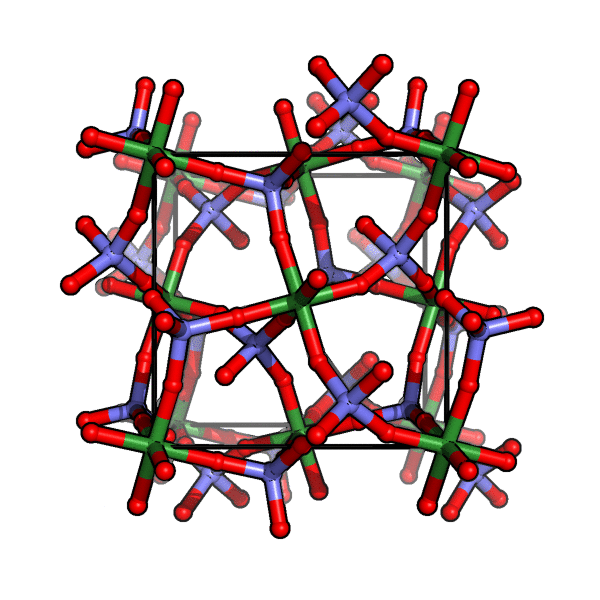

Supporting information for: [“Negative Hydration Expansion in ZrW₂O₈: Microscopic Mechanism, Spaghetti Dynamics, and Negative Thermal Expansion”](https://doi.org/10.1103/PhysRevLett.120.265501), M. Baise, P. M. Maffettone, F. Trousselet, N. P. Funnell, F.-X. Coudert and A. L. Goodwin, _Phys. Rev. Lett._, **2018**, _120_, 265501, DOI: [10.1103/PhysRevLett.120.265501](https://doi.org/10.1103/PhysRevLett.120.265501)

- [`structures.cif`](structures.cif): DFT-optimized structures of ZrW₂O₈, using the LDA and PBESOL0 exchange–correlation functionals. Structures are given for the anhydrous ZrW₂O₈, as well as 5 different hydrated structures ZrW₂O₈·H₂O, labeled A through E (see Table S4 for details).
- [`mode_animation.gif`](mode_animation.gif): animation of the crucial combination mode, contributing to the negative thermal expansion.
 
