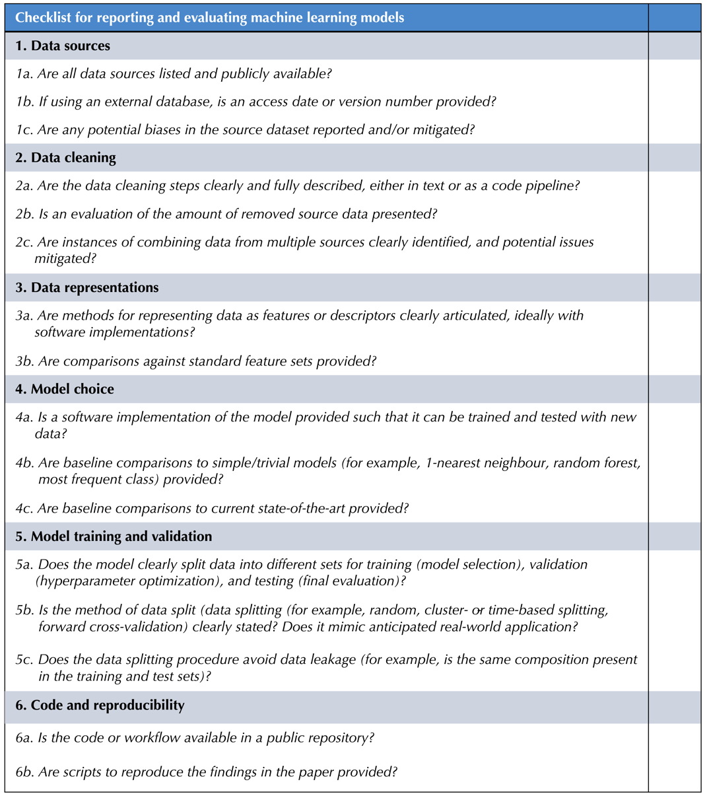

Supporting information for: [“Best practices in machine learning for chemistry”](https://doi.org/10.1038/s41557-021-00716-z), N. Artrith, K. T. Butler, F.-X. Coudert, S. Han, O. Isayev, A. Jain, and A. Walsh, _Nature Chem._, **2021**, 13 (6), 505–508, DOI: [10.1038/s41557-021-00716-z](https://doi.org/10.1038/s41557-021-00716-z)

**Supporting information**

A suggested author and reviewer checklist for reporting and evaluating machine learning models:
- [in PDF format](checklist.pdf)
- [in PNG format](checklist.png)

