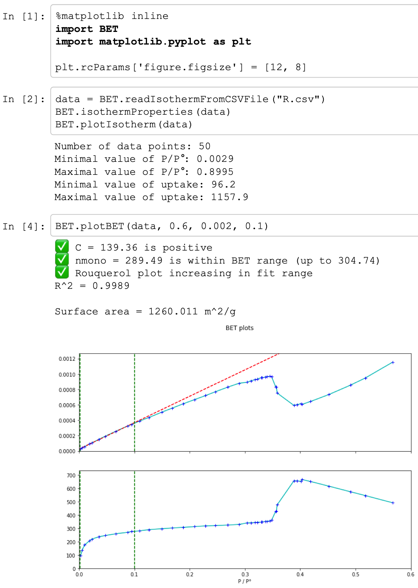

Supporting information for: [“How Reproducible are Surface Areas Calculated from the BET Equation?”](https://doi.org/10.1002/adma.202201502), J. W. M. Osterrieth et al., _Adv. Mater._, **2022**, 34 (27), 2201502, DOI: [10.1002/adma.202201502](https://doi.org/10.1002/adma.202201502)

A first version of this paper was posted as a [preprint on ChemRxiv](https://doi.org/10.26434/chemrxiv-2022-8rhph-v3).

**BET fitting:**

The code used for BET fitting in our group is available to all in a Github repository at
https://github.com/fxcoudert/BET_isotherms_reproducibility

The code requires Python ≥ 3.6 and scientific packages `numpy`, `scipy`, and `matplotlib`. The code is stored in a module named `BET.py` and for each isotherm a Jupyter notebook is available showing the parameters chosen and the fit obtained (from [`A.ipynb`](https://github.com/fxcoudert/BET_isotherms_reproducibility/blob/master/A.ipynb) to [`R.ipynb`](https://github.com/fxcoudert/BET_isotherms_reproducibility/blob/master/R.ipynb)).

The typical criteria (from Rouquerol et al., _Is the BET Equation Applicable to Microporous Adsorbents?_) for fitting are automatically checked, and the quality of the least-square linear fit (_R_2 coefficient) is displayed. Both the BET function and the Rouquerol function are also plotted for visual confirmation of the fit.

